# Polyglot

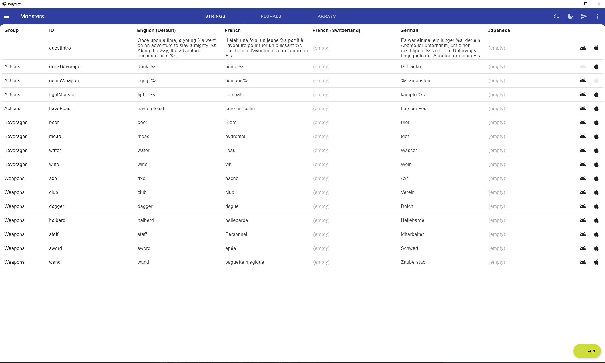
Polyglot is a desktop app for Windows, MacOS, and Linux built in [Compose](https://github.com/JetBrains/compose-jb), written in
100% [Kotlin](https://kotlinlang.org). It manages localized strings for Android and iOS, making it simple to export shared strings. It'll automatically format
localized strings, plurals, and string arrays, as well as generating type-safe R files for Swift, similar to Android, e.g.

    R.string.yourString
    R.plural.yourPlural(quantity: 2, arg0: 2) 
    R.array.yourArray

---
String formatting can be customized, but by default escapes unacceptable characters for xml on both platforms, and handles strings %s, integers %d, and floats
%f.

## Getting started

Clone the repo, sync Gradle, and run the app. You can generate a .jar, .msi, .dmg, or .deb file if you wish. Detailed instructions are available in
the [compose-jb](https://github.com/JetBrains/compose-jb)) repo.

Open the app and create a project. You can go back to this menu later by clicking on the dropdown menu on the top right.

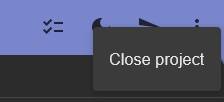

Double click to edit a field. Press enter or click somewhere else to save. Escape to cancel.

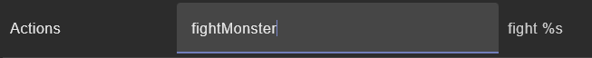

There's a button for light/dark mode in the top right.


## Strings

Default, ordinary localized resources. Click `+ Add` at the bottom to add a new one.

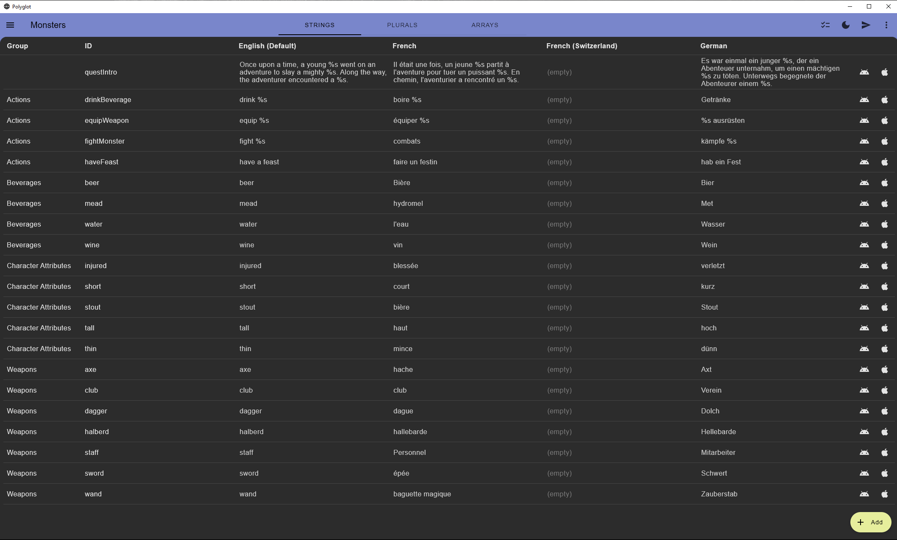

## Plurals

1 cat, 2 cats. Some languages have additional rules. Polyglot expects `One` and `Other` to be included, and there's an expand button for `Zero`, `Two`, `Few`,
and `Many` if you need them.

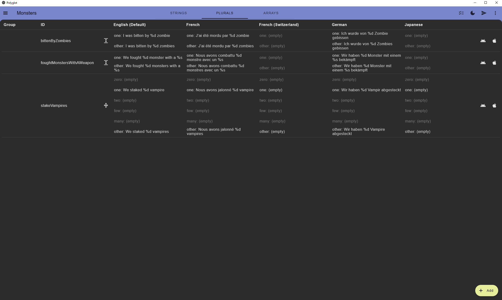

## Arrays

Array of items. Specify the size.

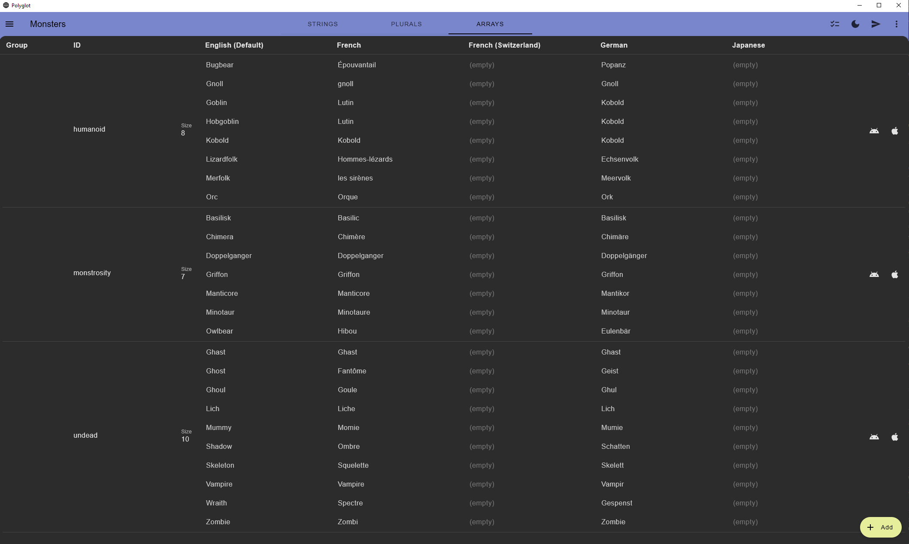

## Groups

Groups are optional organizational labels. If provided, exported files will be grouped together under a comment, e.g.

```
<!--Accessibility-->
<string name="close_menu">Close menu</string>
<string name="feedback_good">Leave positive feedback</string>
```

You can filter by these in the backdrop menu.

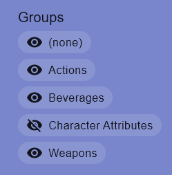

## Multi-select

You can enter multi-select mode by clicking the checklist button on the top right, and add multiple rows to a group, or remove them.

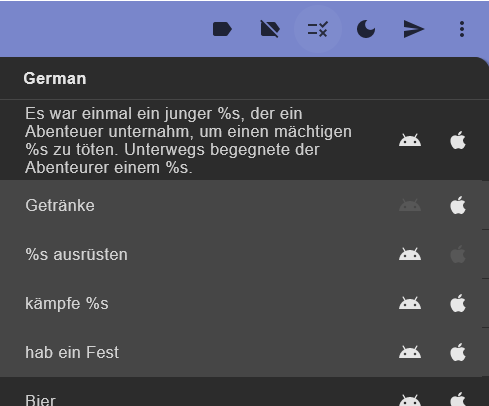

## IDs

Polyglot expects camelCase ids, and will convert these to snake_case for Android. Ids must be unique for each tab (Strings, Plurals, Arrays), but it's okay to
have the same id for a different resource type. Resources are sorted by group and then alphabetically by id.

## Locales

Open the backdrop and click `Add locale` to add a locale. You can also show/hide locales or select a different default locale. All fields must be present for
the default locale, but they can be missing from other locales.

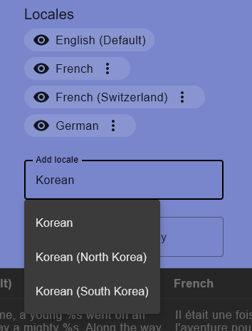

## Google Translate

Add an API key for [Google Cloud Translation](https://cloud.google.com/translate), and for supported languages, Polyglot will translate any missing resources
for you. It won't overwrite any existing values.

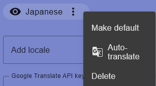

## Platforms

Click on the Android or iOS buttons to specify platform-specific resources. By default, Android and iOS are supported, but Polyglot is designed to be extensible
to other platforms.

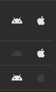

## Save files

Projects are saved in the /projects folder, using Java properties files, though it shouldn't be hard to extend this if you prefer a different file format (
see [PropertyStore](src/main/kotlin/data/PropertyStore.kt)). The contents should be reasonably self-explanatory. Recommend checking these into git with your
project.

## Import project

Expand the backdrop and click Import Resources. You can import any number of files at once, opting to overwrite any duplicates or not.

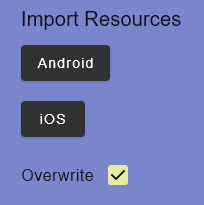

## Export project

To export your project and generate Android/iOS files, click the arrow on the top right. If any part of your project is invalid, it should be highlighted in
red. Click show on the snackbar and it'll open the output folders in Finder/File Explorer. The default output folder is /output/android and /output/ios. You can
change this to output your resource files directly to your project by expanding the backdrop and looking under Export Resources.

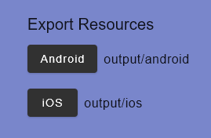
